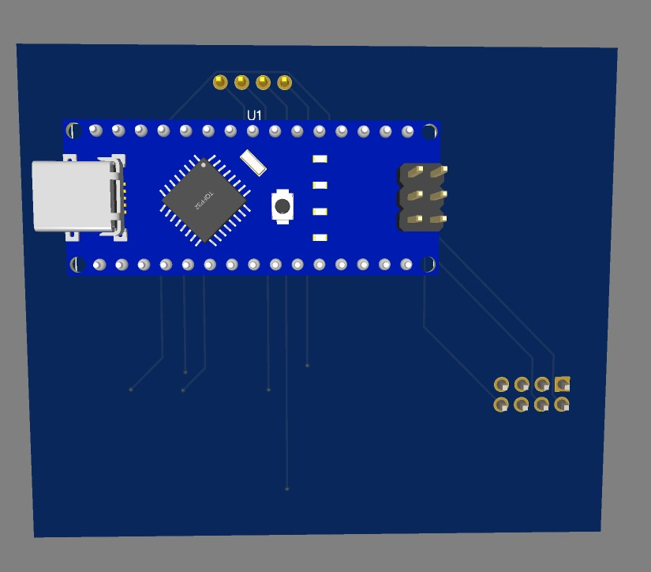
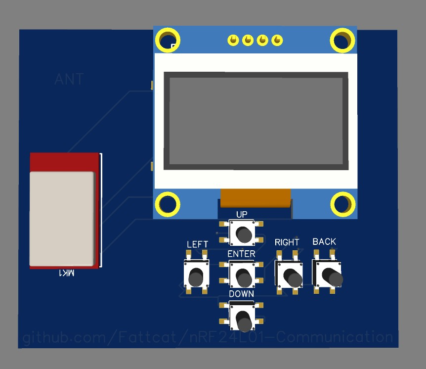
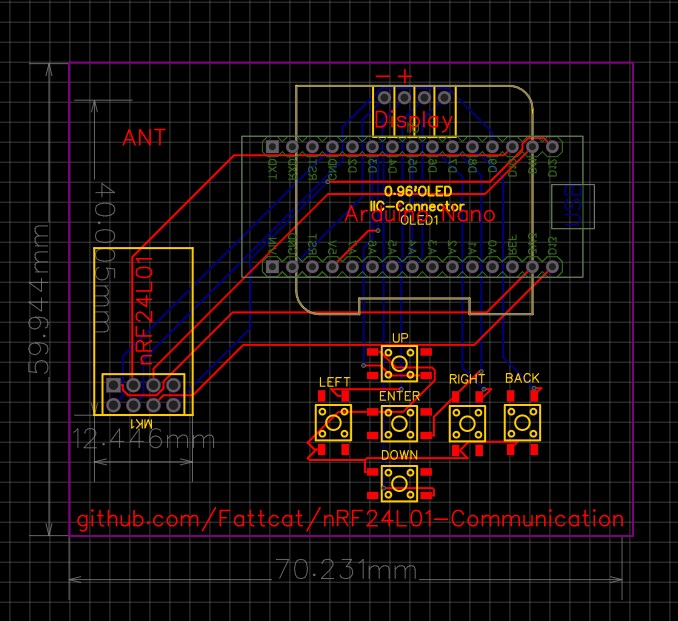
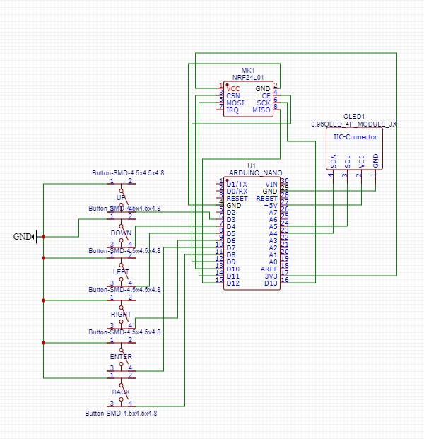

# nRF24L01 - Communication using Serial Monitor
nRF24L01-Communication between 2 Arduino UNO Devices with custom messages.

# Connection
Arduino nRF24L01 --> Arduino UNO
- VCC on the nRF24L01 to 3.3V
- GND - GND
- CE - D9
- CSN - D10
- SCK - D13
- MOSI - D11
- MISO - D12

# Librarry Installation
- RF24.h
- SPI.h

: Components :
 1. nRF24L01 
 - Cost : About 2 €  
 - AliExpress Link : https://www.aliexpress.com/item/32517849393.html?spm=a2g0o.order_list.order_list_main.5.53341802zR7CBu

 2. Arduino UNO
 - Cost : About 3 €
 - AliExpress Link : https://www.aliexpress.com/item/32932088536.html?spm=a2g0o.order_list.order_list_main.15.272c1802A1wYyH

 3. Some Wires for Connect it
 - Cost : About 1 €
 - AliExpress Link : https://www.aliexpress.com/item/1005005945668553.html?spm=a2g0o.productlist.main.5.3ee96589bktPwT&algo_pvid=10843895-becd-41e7-bb9e-6ba514305112&algo_exp_id=10843895-becd-41e7-bb9e-6ba514305112-2&pdp_npi=4%40dis%21EUR%215.02%211.74%21%21%2137.99%21%21%40211b600e16979140499187979e18b2%2112000034970736149%21sea%21SK%214031371332%21&curPageLogUid=jRvt0BDum3lC

## Some Images of board

