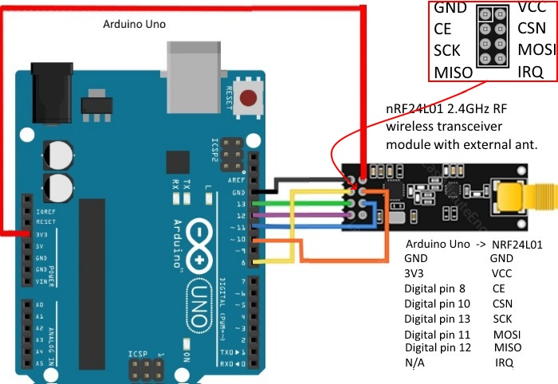

# nRF24L01 - Communication
nRF24L01-Communication devices with custom messages and channels.

## Please support this project by giving star this project 

# Connection
Arduino nRF24L01 --> Arduino UNO
- VCC on the nRF24L01 to 3.3V
- GND - GND
- CE - D9
- CSN - D10
- SCK - D13
- MOSI - D11
- MISO - D12
 
- Default Freq -> 2476 MHz
- Default Channel -> 76

# Librarry Installation
- RF24.h
- SPI.h
 ### Please Chose code for upload between code with Oled or using PC and Serial Monitor in Arduino IDE. 
# : Components :
 1. nRF24L01 
 - Cost : About 2 €  
 - Link : [AliExpress Link](https://www.aliexpress.com/item/32517849393.html?spm=a2g0o.order_list.order_list_main.5.53341802zR7CBu)

 2. Arduino UNO
 - Cost : About 3 €
 - Link : [AliExpress Link](https://www.aliexpress.com/item/32932088536.html?spm=a2g0o.order_list.order_list_main.15.272c1802A1wYyH)

 3. Some Wires for Connect it
 - Cost : About 1 €
 - Link : [AliExpress Link](https://www.aliexpress.com/item/1005005945668553.html?spm=a2g0o.productlist.main.5.3ee96589bktPwT&algo_pvid=10843895-becd-41e7-bb9e-6ba514305112&algo_exp_id=10843895-becd-41e7-bb9e-6ba514305112-2&pdp_npi=4%40dis%21EUR%215.02%211.74%21%21%2137.99%21%21%40211b600e16979140499187979e18b2%2112000034970736149%21sea%21SK%214031371332%21&curPageLogUid=jRvt0BDum3lC)
 4. Oled 0.96" Display
 - Cost : About 3 €
 - Link : [AliExpress Link](https://www.aliexpress.com/item/1005003780343300.html?spm=a2g0o.order_list.order_list_main.10.3fe11802lmRDEd)
 5. 6x Button
   - Cost : 100pcs About 1 €
   - Link : [AliExpres Link](https://www.aliexpress.com/item/1005004001434474.html?spm=a2g0o.order_list.order_list_main.4.55ba1802EP7ABM)
# Some Images

